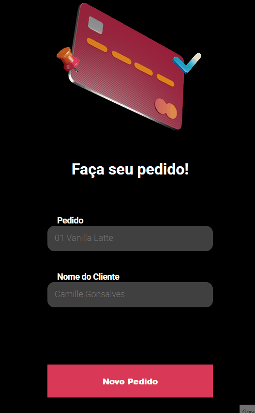

# Food Order App

A simple React application for creating and managing food orders, built with an API that already exists in my repositories (order-management-api)
## Overview

This application allows users to:
- Create new food orders with client names
- View all existing orders
- Delete orders
- Persist data using a backend API

# Here's a Preview



## Technologies Used

- React
- Axios (for API requests)
- React Router DOM (for navigation)
- Styled Components (for styling)

## Installation

1. Clone the repository
```
git clone https://github.com/CamilleGS/food-order-app.git
cd food-order-app
```

2. Install dependencies
```
npm install
```

3. Start the development server
```
npm start
```

4. Start the backend server
```
npm run server
```

## API Endpoints

The application uses the following API endpoints:
- `GET /order` - Fetch all orders
- `POST /order` - Create a new order
- `DELETE /order/:id` - Delete an order by ID

## How to Use

1. Enter the order details in the input fields
2. Click "Novo Pedido" to add the order
3. View the list of orders below
4. Click the trash icon to delete an order

## Author

CamilleGS
